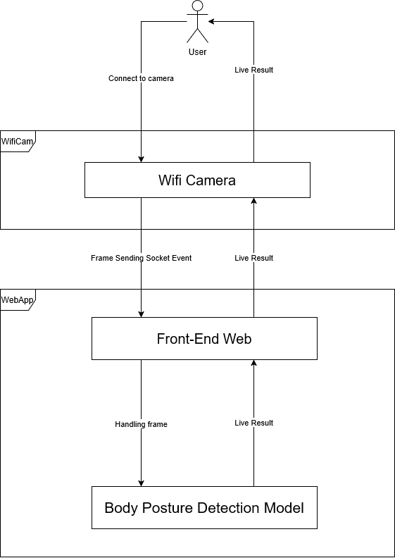

# PBL5 - Body Posture Detection

## 1. Tech Stack

- CameraSocket: C/C++
- WebApp: Python (Django)

## 2. Flow

**Brief:** Camera on -> Socket Client Sending Event to Server -> Server Model Frame Handling -> Prediction Result Sending Back Event -> Showing Live Result

## 3. Todo List

* [ ] Camera Socket
* [ ] WebApp
* [X] Models (Current: [best_model.resolved.h5](./_models/best_model.resolved.h5) ).

---

# License

